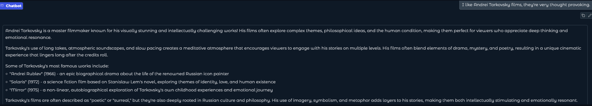
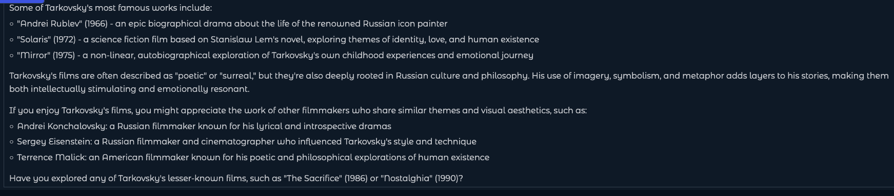
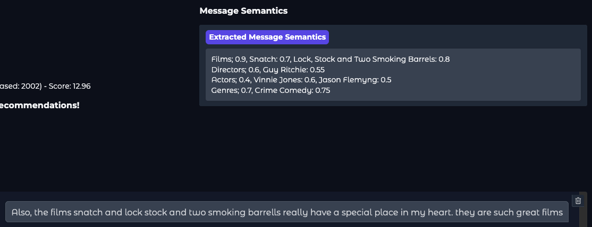
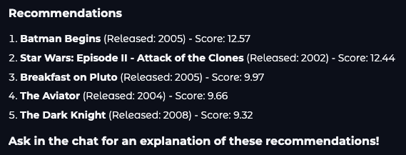
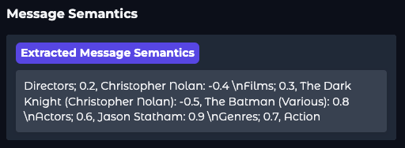
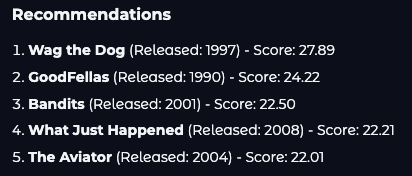
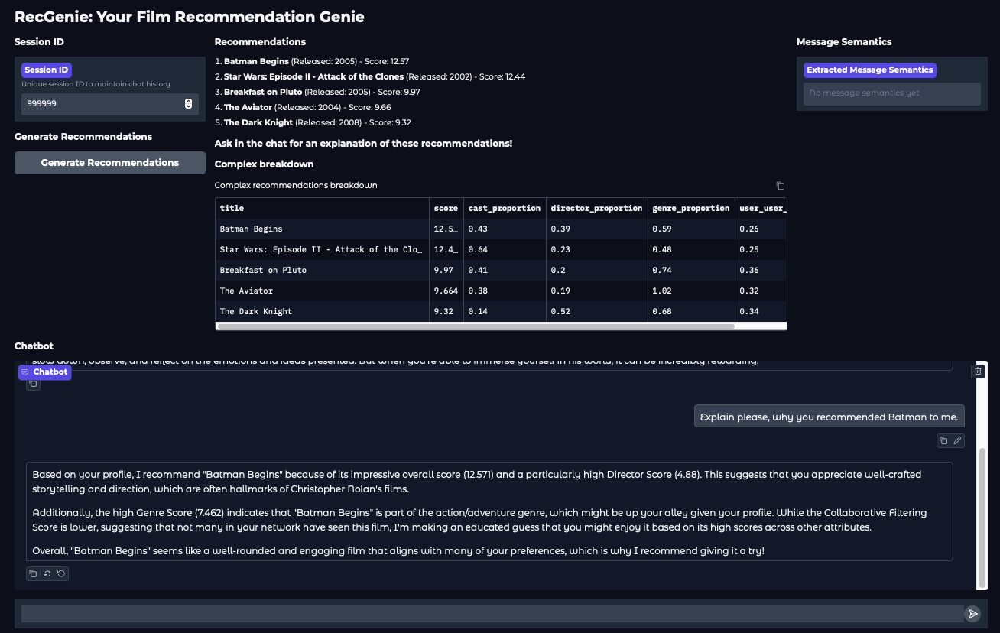

# Rec-Genie: Conversational Recommendation System

Rec-Genie is an innovative proof-of-concept system that merges **Large Language Models (LLMs)** with **traditional recommendation algorithms** to deliver personalized, transparent, and adaptable recommendations through a conversational interface.

Developed as part of my final year project, Rec-Genie explores the cutting-edge intersection of LLMs and recommendation systems. This project demonstrates how conversational AI can revolutionize user interactions by dynamically adapting to preferences and feedback in real-time.

By combining the strengths of LLMs and hybrid recommendation techniques, Rec-Genie showcases the potential to transform how users discover and engage with personalized content.

> **Note:** This project is a **proof-of-concept** designed to showcase the exciting potential of combining Large Language Models with recommendation systems. 
While the code may not be perfect and the system has not been heavily optimized for performance, it serves as a compelling demonstration of the possibilities in this innovative research area. 

## Table of Contents
- [Report](#report)
- [Features](#features)
- [Example Use Cases](#example-use-cases)
- [License](#license)
- [Acknowledgements](#acknowledgements)
- [Contact](#contact)

---

## Report
The full report for this project can be found [here](FinalReport_CathalLawlor.pdf).

## Features

### **Adjustable and Explainable Hybrid Recommendation System**
- Combines **content-based filtering** and **collaborative filtering** to provide tailored recommendations.
- Dynamically adjusts recommendations based on user feedback and preferences.
- Provides score breakdowns for recommendations, enhancing transparency and user trust. 

### **Conversational Interface**
- The system interacts with users through a conversational chatbot interface.
- Users can explore preferences, provide feedback, and ask for explanations.

### **Large Language Model Agent Integration**
- Utilizes a quantized **LLM** for efficient and lightweight conversational capabilities.
- The agent extracts user preferences and feedback, explores user interests, and provides explanations for recommendations.

### **Real-time Updates and Modular Design**
- The system updates user profiles and recommendations in real-time based on user interactions.
- Modular design allows for easy integration of new recommendation algorithms and data sources.

### **User Profile Customization**
- Users can start with a **template profile** (e.g., Action & Crime, Romcoms) or build one from scratch.
- Profiles are updated dynamically based on user interactions and feedback with the agent.

---

## Example Use Cases

### 1. **User preferences exploration**
Users can explore their preferences through conversation with the chatbot. It acts as a guide to help them discover new films, genres, and themes.

---

### 2. **User Interaction**
The system allows users to provide feedback on recommendations, preferences, and dislikes.
It gleans information from user interactions to refine recommendations.

---

### 3. **Recommendations, Adjustments, and Updates**
The system generates recommendations based on the user's profile and preferences.

The user can provide feedback on the recommendations, such as "I don't like movies with too much gore."
The system will then adjust the recommendations accordingly.

As seen below, user preferences are extracted from the user input and used to update the user profile.

The system will then generate new recommendations based on the updated profile, dynamically adjusting to the user's preferences.

As you can see, Batman is no longer in the top 5 recommendations, and the system has adjusted the recommendations to better suit the user's preferences.

---

### 4. **Recommendation Breakdown**
Users can ask for an explanation of why a specific recommendation was made.

The system provides a detailed breakdown of the recommendation, explaining to the user why and how it was made.

---

## License

This project is licensed under the **Creative Commons Attribution-NonCommercial 4.0 International (CC BY-NC 4.0)** license.  
You are free to share and adapt the work, but you must give appropriate credit and may not use it for commercial purposes.  
For more details, see the [LICENSE](LICENSE) file or visit [Creative Commons](http://creativecommons.org/licenses/by-nc/4.0/).

## Acknowledgements
Special thanks to:

- Dr. Colm O'Riordan for supervision and guidance.
- Pearse Carroll, Joe O'Connell, and Gergely Toth for their valuable insights and support.

## Contact
If you would like to get in touch, find me here:
- Email: [cathal.lawlor33@gmail.com](mailto:cathal.lawlor33@gmail.com)
- Linkedin: [linkedin.com/in/cathal-lawlor/](www.linkedin.com/in/cathal-lawlor/)

